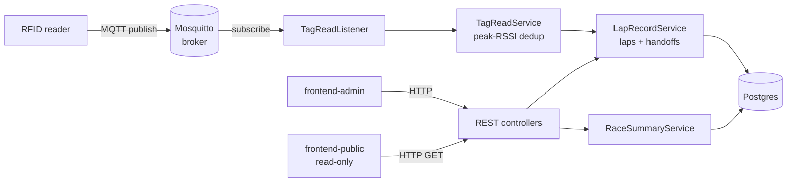

# 8hour-relay

Race timing system for an 8-hour team relay: runners carry RFID tags, an
RFID reader publishes tag reads over MQTT, and the backend turns those reads
into laps, leg handoffs, and a live leaderboard.

## Tech stack

- **Backend** — Java 21, Spring Boot, Spring Data JPA/Hibernate, Eclipse
  Paho (MQTT client)
- **Database** — PostgreSQL
- **Messaging** — Eclipse Mosquitto (MQTT broker) between the RFID reader
  hardware and the backend
- **Frontend** — React, TypeScript, Vite; one codebase built twice into two
  differently-privileged bundles (see [Security](#security))
- **Web server / reverse proxy** — nginx, serving the static frontend build
  and reverse-proxying `/api/` to the backend, with a different config per
  bundle (see [Security](#security))
- **Containerization** — Docker + Docker Compose; every service (Postgres,
  Mosquitto, backend, both frontends) is defined in one `docker-compose.yml`
  and comes up with a single command — no cloud dependency, runs entirely on
  a laptop at the event with no internet required once built (see
  [Running with Docker](#running-with-docker) and
  [offline builds](#building-fully-offline))
- **Public exposure** — ngrok, tunnelling only the read-only board out to
  spectators without opening anything else to the internet

## Architecture



### Data model

- **Team** → has many **Runner**s, each assigned a `leg` (1, 2, 3, ...).
- **Runner** → one-to-one with a **Tag** (an RFID EPC), and a `status` of
  `ACTIVE` (currently out on course) or `INACTIVE`.
- **Tag** → `RUNNER` tags are worn by people; other tag types (e.g. a fixed
  checkpoint/mat tag) just log laps without going through handoff logic.
- **LapRecord** → one row per registered tag read: a `timestamp` (the RFID
  reader's own clock), an optional `lapTime`, a `status`
  (`START` / `VALID` / `INVALID`), and a nullable `handoffAt` (server clock,
  set only when the record was created by a handoff — see below).
- **RaceState** → one row per Start/Stop click; `RaceStateService.getStartedAt()`
  always reads the most recent one.

### RFID → lap pipeline

1. `TagReadListener` (`mqtt/`) subscribes to `relay/read` and parses each
   Impinj-style `tagInventoryEvent` message (EPC, RSSI, and the reader's own
   `timestamp` field).
2. `TagReadService` batches reads per tag over a `READ_WINDOW` (5s) and keeps
   only the strongest-RSSI read in that window — a single physical tag pass
   triggers several raw reads as it moves past the antenna, so this collapses
   them into one canonical "the tag was here" event before it reaches the lap
   logic.
3. `LapRecordService.saveLapRecord` builds the `LapRecordEntity` (`START` if
   there's no prior lap or the gap exceeds `LEG_TIMEOUT`, otherwise `VALID`
   with a computed `lapTime`) and, for `RUNNER` tags, calls `checkHandoff`.
4. `RaceSummaryService` aggregates `LapRecord`s into the per-team,
   per-runner stats (laps, distance, pace, ranks) the frontend polls.

### Handoff detection (`LapRecordService.checkHandoff`)

Three independent gates all have to pass before a tag read is treated as a
real handoff between two runners on the same team:

- **Leg-timing window** — legs are nominally `LEG_TIME` minutes long on a
  clock anchored to the race's start time (not to any individual runner's
  pace). A handoff is only accepted within `HANDOFF_ENABLED_WINDOW` of a leg
  boundary (symmetric — before _and_ after), so stray reads mid-leg can't be
  mistaken for an exchange.
- **Physical-adjacency window** — the outgoing and incoming runners' tags
  must both have been read within `HANDOFF_WINDOW` (500ms) of each other,
  confirming an actual exchange rather than two unrelated reads.
- **Cooldown** — once a runner has been handed off _to_, no further handoff
  can flip their status again until `2 × HANDOFF_ENABLED_WINDOW` has passed,
  so a leg-timing window that's still open right after a handoff can't
  immediately trigger a second one.

All the timing constants live in `config/Config.java`.

### Frontend

Single Vite + React + TypeScript codebase, built twice with different
`VITE_READ_ONLY` values (see "Public board vs. admin board" below) into the
two frontend containers. Pages live in `src/pages/` (`Dashboard`,
`LeaderboardPage`, `TeamEditPage`, `AddTeamPage`); shared chrome lives in
`src/components/` (`BoardHeader` for nav/race controls, `RaceStatsBar` for
the race-time/remaining/status bar used on both boards, `Dropdown`).

## Security

**The threat this design defends against:** the board needs to be visible to
people who aren't on the event's local network — friends, family, and
spectators watching remotely over the 8 hours — which means tunnelling it
out over the public internet (via ngrok). Anything reachable through that
tunnel is reachable by anyone with the link, indefinitely, for the whole
event. If the tunnelled port were the same one race organizers use to
control the event, anyone with the link could start/stop the race, edit
teams, or wipe lap records mid-event — not a hypothetical, since ngrok URLs
get shared around informally at events like this.

**Design: two builds from one codebase, enforced twice.** Rather than one
frontend with client-side role checks (trivially bypassed — it's just
JavaScript the browser fully controls), the same React/TS source is compiled
twice via a `VITE_READ_ONLY` build-time flag into two separate Docker
images:

- `frontend-admin` — every control (Start/Stop Race, Add Team, Edit, Clear).
  Bound to `127.0.0.1` only, in `docker-compose.yml` — it is not on the LAN
  and structurally cannot be tunnelled, because there's no non-loopback
  interface for ngrok to attach to.
- `frontend-public` — the only bundle ever exposed off the machine (LAN or
  tunnel). The React build itself strips out every mutating control, but
  that alone is a UI nicety, not security — a hidden button doesn't stop a
  direct `curl -X POST` to the API underneath it. The real enforcement is
  server-side, in `frontend/nginx.public.conf`:
  ```
  location /api/ {
      limit_except GET HEAD {
          deny all;
      }
      proxy_pass http://backend:8080/api/;
      ...
  }
  ```
  Any request to `/api/` that isn't `GET`/`HEAD` is rejected by nginx before
  it ever reaches the backend — independent of, and a backstop for, the
  frontend build flag.

**Defense in depth on the data path too.** Postgres publishes no host port
at all, and the Spring Boot backend (`8080`) is bound to `127.0.0.1` only —
neither is reachable from outside the host, tunnel or no tunnel. The two
nginx containers are the only entry points into the backend, and they reach
it over the internal Docker network regardless of these host bindings.

**A trade-off, documented rather than hidden:** Mosquitto is the one service
bound to all interfaces, with `allow_anonymous true`
(`mosquitto/mosquitto.conf`), because the physical RFID reader hardware
needs to publish to it directly over the event LAN, not just from inside
Docker — there's no practical way to keep that loopback-only. That's an
accepted, scoped trade-off for a single controlled event network, not an
oversight; hardening it further (MQTT username/password auth, or TLS) would
be the next step for a deployment that couldn't trust its local network.

## Known issues encountered & fixes

Running log of real problems hit while getting this working end to end —
kept here instead of in throwaway chat history so the reasoning survives.
Newest at the bottom.

- **MQTT initial connect wasn't resilient to broker startup order.**
  `docker compose up` could start the backend before Mosquitto was ready to
  accept connections, and `setAutomaticReconnect(true)` only covers a
  connection lost _after_ it was first established — it doesn't retry a
  failed first connect. Fixed by wrapping the initial `connect()` in a retry
  loop (`TagReadListener`).
- **Exceptions in the scheduled read-flush task vanished with no trace.**
  `ScheduledExecutorService` swallows exceptions thrown from a scheduled
  `Runnable` — they're only visible via the discarded `Future`, so a failure
  in `flushRead` left nothing in the logs. Added a try/catch with logging
  around it (`TagReadService`).
- **Handoff window silently never fired.** `checkHandoff` gated the leg-timing
  window by comparing a tag read's own embedded timestamp (the RFID reader's
  clock) against `raceStart` (stamped by the backend server's clock). The
  reader's clock turned out to be running several minutes behind the
  server's — confirmed by diffing read-arrival times in the backend logs
  against the reader's embedded timestamps, after first ruling out
  container/host clock skew. Every read then looked like it happened
  _before_ the race even started, so the gate rejected everything with no
  logged reason. Fixed by gating on the server's own receipt time
  (`Instant.now()`) instead, since reads arrive within seconds of the
  physical pass — the reader's clock is untrustworthy but not needed for
  this comparison anyway. The reader's onboard clock should still be
  NTP-synced as the real hardware fix; this makes the backend resilient
  regardless.
- **`LEG_TIME`/`HANDOFF_ENABLED_WINDOW` config didn't match the intended leg
  format.** The values in place (4 min legs, a 3 min enable window) meant a
  handoff could register from 1 minute into a leg all the way to the end of
  it — nothing like the intended "3 minute legs, exchange enabled once 2
  minutes in." Corrected to `LEG_TIME=3`, `HANDOFF_ENABLED_WINDOW=1`.
- **The enable window only opened _before_ a leg boundary, never after.**
  The check only measured time remaining until the _next_ boundary, so it
  closed the instant a boundary was crossed and didn't reopen until the next
  cycle's window. Changed to measure distance to the _nearest_ boundary in
  either direction, making the window symmetric around each leg boundary.
- **Race start itself was treated as a leg boundary.** The symmetric-window
  math above has a modulo that naturally lands on `t=0`, which opened a
  bogus handoff window in the race's first `HANDOFF_ENABLED_WINDOW` even
  though there's no previous leg to hand off from at the start of the race.
  Guarded against explicitly.
- **Rapid back-to-back handoffs weren't actually blocked.** A cooldown was
  added after the fix above (to stop a handoff from re-triggering within the
  same still-open window) by reading back the timestamp of the runner's most
  recent `START` lap and comparing it to `Instant.now()`. That timestamp was
  still the RFID reader's clock, so the same clock-skew problem as the
  race-start bug above made the cooldown always look satisfied — a handoff
  immediately followed by another (e.g. leg 2→3 right after 1→2) went
  through when it should have been blocked. Fixed by adding a dedicated
  nullable `handoff_at` column on `lap_records`, stamped with the server
  clock only when a record is created by an actual handoff, and comparing
  cooldowns against that instead of the reader-clock `timestamp` column —
  which stays untouched so reader-clock-based lap-time math elsewhere isn't
  affected.

## Running with Docker

Start postgres, mosquitto, backend, and both frontends together:

```
docker compose up -d --build
```

Check everything is up:

```
docker compose ps
```

Stop everything:

```
docker compose down
```

## Building fully offline

The whole stack is designed to run at an event with no internet available,
as long as it's been built at least once beforehand:

- `postgres:16-alpine` and `eclipse-mosquitto:2` are pulled once and then
  reused from the local Docker image cache on every subsequent
  `docker compose up` — Compose only pulls an `image:` service if it's
  missing locally.
- The four base images the multi-stage Dockerfiles build from
  (`eclipse-temurin:21-jdk`/`21-jre`, `node:22-alpine`, `nginx:alpine`) are
  pulled and tagged explicitly with `docker pull`, so they're durable local
  images rather than only living in Docker's internal build cache (which can
  be evicted by a prune or lost on a different machine).
- At the event itself, run `docker compose up -d` **without** `--build` —
  it starts straight from the already-built `8hour-relay-*` images with zero
  network calls. Only rebuilding (`--build`) after a dependency change
  (`package.json`/`package-lock.json`, Gradle files) needs the internet
  again, to re-resolve those dependencies.

## Public board vs. admin board

There are two frontend containers built from the same codebase, split by the
`VITE_READ_ONLY` build flag:

- **`frontend-public`** — `http://localhost` (port 80, bound to all
  interfaces). Read-only: no Add Team, Edit, Start/Stop Race, or Clear
  buttons. This is the one safe to put on the event LAN or tunnel to the
  internet — its nginx config (`frontend/nginx.public.conf`) also rejects
  every non-GET/HEAD request to `/api/` at the proxy level, so even a direct
  API call (not just the hidden buttons) can't mutate race data through it.
- **`frontend-admin`** — `http://localhost:3000`, bound to `127.0.0.1` only
  (not reachable from the LAN or a tunnel). Has every control: Add Team,
  Edit, Start/Stop Race, Clear Lap Records, Clear All.

Postgres publishes no host port at all — only the backend needs to reach it,
over the internal Docker network. The backend (`8080`) is bound to
`127.0.0.1` only. Mosquitto (`1883`) is the one exception, bound to *all*
interfaces on purpose: the physical RFID reader is a separate device on the
event LAN and has to reach the broker directly, not just from inside Docker
(see [Security](#security) for the trade-off this implies).

## Exposing the public board to the internet (ngrok)

Use this to let people outside your local network view the board (e.g. at an
event). Only ever tunnel port **80** (`frontend-public`) — never port 3000.

1. Make sure the containers are running (`docker compose up -d`).
2. Start a tunnel to port 80:
   ```
   ngrok http 80
   ```
3. Share the `https://....ngrok-free.dev` URL shown under "Forwarding". Leave the terminal window open for the URL to keep working.
4. A custom/reserved subdomain requires a paid ngrok plan — the free random URL stays the same as long as the tunnel isn't restarted.
5. Run race control (Start/Stop, Add Team, Edit, Clear) from `http://localhost:3000` on the machine running Docker — never expose that port.
